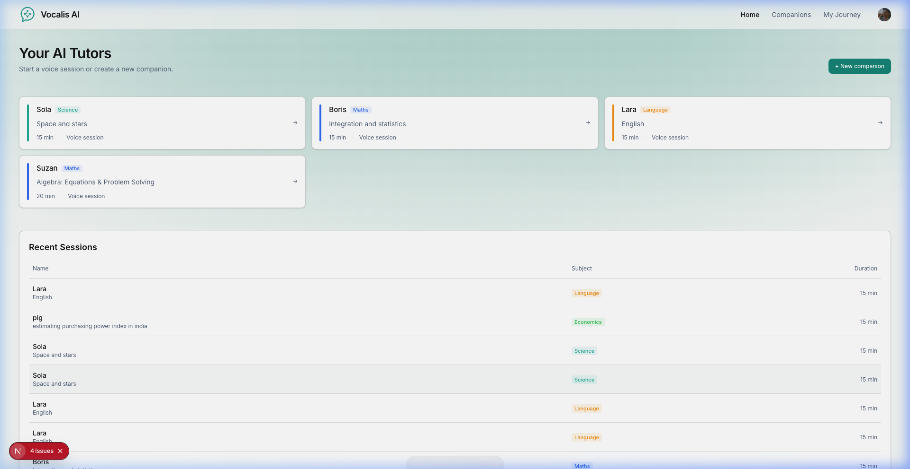
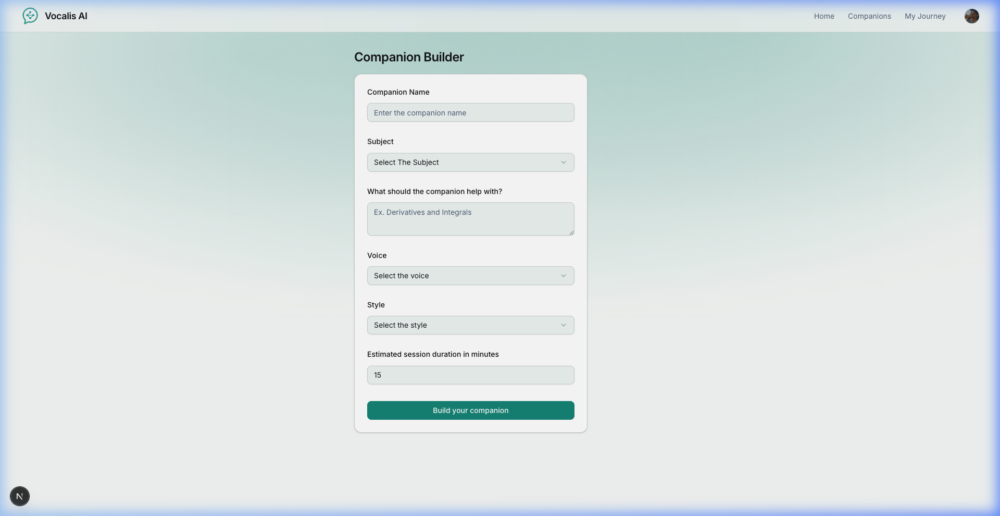
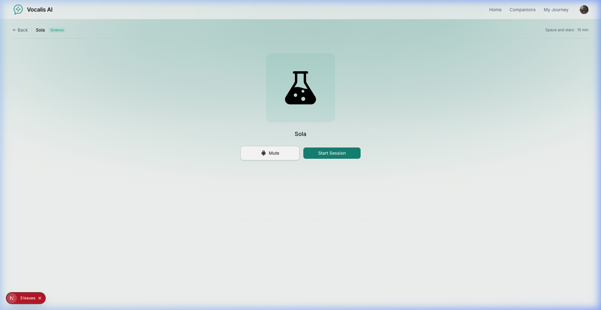

# Vocalis AI — Voice Tutoring Platform

A real-time, voice-powered AI tutoring platform. Students learn through natural voice conversations with personalized AI companions — powered by GPT-4, ElevenLabs, and Vapi.

## Screenshots

### Home Page
Light theme with a subtle teal gradient, companion cards with colored accent bars, and a recent sessions table.



### Companion Builder
Centered form to create a custom AI tutor — choose a name, subject, voice, style, and session duration.



### Voice Session
Centered session layout — subject avatar, mute/start controls, and live transcript powered by Vapi.



## Tech Stack

| Layer          | Technology                                    |
| -------------- | --------------------------------------------- |
| Framework      | Next.js 16 (App Router, React 19)             |
| Auth           | Clerk (sign-in, subscriptions, permissions)   |
| Database       | Supabase (PostgreSQL)                         |
| Voice AI       | Vapi (real-time voice, GPT-4 + ElevenLabs)   |
| Styling        | Tailwind CSS v4, shadcn/ui, Lottie animations |
| Error Tracking | Sentry                                        |

## Features

- **Voice-powered tutoring** — Real-time conversations with AI tutors via Vapi
- **Personalized companions** — Choose name, subject, voice (male/female), and teaching style (formal/casual)
- **Pre-built companions** — 3 template tutors (Lara, Boris, Suzan) seeded on first load
- **Subject library** — Browse and search companions by subject
- **Session tracking** — Full history of completed tutoring sessions
- **Bookmarks** — Save favorite companions for quick access
- **Subscription tiers** — Clerk-powered pricing with companion creation limits

## Getting Started

### Prerequisites

- **Node.js** ≥ 18
- Accounts on [Clerk](https://clerk.com), [Supabase](https://supabase.com), [Vapi](https://vapi.ai)

### 1. Install dependencies

```bash
npm install
```

### 2. Configure environment variables

```bash
cp .env.local.example .env.local
```

Fill in your keys:

| Variable | Source |
| -------- | ------ |
| `NEXT_PUBLIC_CLERK_PUBLISHABLE_KEY` | [Clerk Dashboard](https://dashboard.clerk.com) → API Keys |
| `CLERK_SECRET_KEY` | [Clerk Dashboard](https://dashboard.clerk.com) → API Keys |
| `NEXT_PUBLIC_SUPABASE_URL` | [Supabase Dashboard](https://supabase.com/dashboard) → Settings → API |
| `NEXT_PUBLIC_SUPABASE_ANON_KEY` | [Supabase Dashboard](https://supabase.com/dashboard) → Settings → API |
| `NEXT_PUBLIC_VAPI_WEB_TOKEN` | [Vapi Dashboard](https://dashboard.vapi.ai) → API Keys |

### 3. Set up the database

Run `supabase-schema.sql` in your [Supabase SQL Editor](https://supabase.com/dashboard). This creates:

- `companions` — AI tutor definitions
- `session_history` — completed voice sessions
- `bookmarks` — user favorites

### 4. Start the dev server

```bash
npm run dev
```

Open **http://localhost:3000**. Three template companions (Lara, Boris, Suzan) are seeded automatically.

## Available Scripts

| Command        | Description              |
| -------------- | ------------------------ |
| `npm run dev`  | Start development server |
| `npm run build`| Build for production     |
| `npm run start`| Start production server  |
| `npm run lint` | Run ESLint               |

## Project Structure

```
├── app/                          # Next.js App Router pages
│   ├── layout.tsx                # Root layout (ClerkProvider, Navbar)
│   ├── page.tsx                  # Home — companion cards + recent sessions
│   ├── globals.css               # Global styles & light theme
│   ├── companions/
│   │   ├── page.tsx              # Companion library (search + filter)
│   │   ├── new/page.tsx          # Create companion form
│   │   └── [id]/page.tsx         # Voice session page
│   ├── my-journey/page.tsx       # Profile + session history
│   ├── sign-in/                  # Clerk sign-in page
│   └── subscription/page.tsx     # Clerk pricing table
├── components/                   # React components
│   ├── Navbar.tsx                # Navigation bar
│   ├── NavItems.tsx              # Navigation links
│   ├── CompanionCard.tsx         # Horizontal card with accent bar
│   ├── CompanionsList.tsx        # Session history table
│   ├── CompanionComponent.tsx    # Voice session UI (Vapi + Lottie)
│   ├── CompanionForm.tsx         # Companion builder form
│   ├── CTA.tsx                   # Call-to-action section
│   ├── SearchInput.tsx           # Debounced search
│   ├── SubjectFilter.tsx         # Subject dropdown filter
│   └── ui/                       # shadcn/ui primitives
├── lib/
│   ├── utils.ts                  # Helpers, Vapi assistant config
│   ├── supabase.ts               # Supabase client
│   ├── vapi.sdk.ts               # Vapi SDK init
│   └── actions/
│       └── companions.actions.ts # Server actions (CRUD, seeding)
├── constants/index.ts            # Subjects, colors, voices, templates
├── types/                        # TypeScript declarations
├── proxy.ts                      # Clerk authentication middleware
└── public/                       # Static assets (icons, images)
```